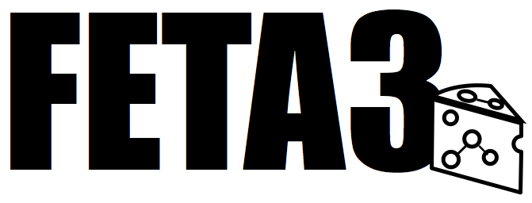

# About
FETA stands for "Framework for Evolving Topology Analysis", and is a multi-purpose java-based software for the analysis of evolving networks and models for their topology.

## What can I use FETA for?

* Obtaining time series of measurements on growing directed and undirected networks
* Growing networks from a range of models and combinations of these
* Fitting models to timestamped network data.
* (Soon) investigating changes in network growth over time

## What can't I use FETA for?

* Networks with disappearing nodes or edges
* Weighted networks/multigraphs

# Building and running

## Requirements

This software runs using Java, so if you haven't already, install the latest version [here](https://www.java.com/en/download/). 

The jar file is built using Apache Ant, which can be found [here](https://ant.apache.org/).

## Installation

First clone the repository, either manually or using the command: 

```$xslt
git clone https://github.com/narnolddd/FETA3.git
```

## Building

Then run the command:

```$xslt
ant jar
```

to make the jar file.

## Running

Once you have the jar file, FETA is executed from the command line as:

```$xslt
java -jar feta3-1.0.0.jar scripts/[some-script-name].json
```

The single argument `scripts/[some-script-name].json` is a JSON config file telling FETA what action to perform. The next section describes how this works.

# JSON Structure

Each JSON file has three sections: DataOptions, Action and Model.

## Datafile 

The datafile contains the information about any input or output network files to be read/written by FETA. It is comprised as follows:

```JSON
{
"Data": {
    "GraphInputFile": "someFileName.dat",
    "InputType": "someInputType",
    "InputLineSeparator": "\\s+",
    "Directed": false,
    "OutputType": "someOutputType",
    "GraphOutputFile": "someOtherFileName.dat"
    }
}
```

* The fields `GraphInputfile` and `GraphOutputFile` refer to the filenames of network edgelists to be inputted and outputted respectively, if applicable.
The default values for these are `seed_graphs/clique-5.dat` and `output/yyyyMMddHHmmss.dat` (i.e. a timestamped filename in the output folder).

* `Directed` specifies whether the the network should be treated as directed or not - default is `false`.

* `InputLineSeparator` specifies the separator to use for reading edgelists - default is `\\s+` (i.e. tab). 

* Input and output types tell the network reader what type of edgelists to expect. The two options are `NN` (Node1 Node2) or 
`NNT` (Node1 Node2 Timestamp) where nodes are parsed as strings and timestamps as longs. Default option is `NNT` since FETA is 
geared up for temporal networks. If `NN` is chosen, each edge will be treated as arriving in the order it appears in the list, in
order to treat it as temporal.

## Action

The action section tells FETA what to do with the network file it has read in. Options are `Measure`, `Grow`, `Likelihood` and `Translate`.

### Measure

`Measure` will return a time series of network metrics in a TSV. For undirected networks, these are time, number of nodes, number of links, average
degree, network density, maximum degree, average clustering coefficient, mean squared degree and degree assortativity, printed left to right in that order. 

and for directed networks, the same measures returned will be time, number of nodes/links, maximum in/out degree, mean squared in/out degree and in/out
degree assortativity.

An example of the Action tag for measuring networks is:

```JSON

{
  "Action": {
    "Measure": {
      "Start": 10,
      "Interval": 10,
      "MaxLinks": 300,
      "MaxNodes": 100,
      "MaxTime" : 1000
    }
  }
}

```

`Start` refers to when to start taking measurements (given as long value), `Interval` specifies the time granularity of the measurements, and
`MaxLinks`/`MaxNodes`/`MaxTime` altogether specify a stopping condition - the measurements will stop being taken when any one of these conditions are
reached. Not all of these need be specified, but at least one does.

As an example, running:

```$xslt
java -jar feta3-1.0.0.jar scripts/Measure.json
```

with an appropriately written measure script, returns:

```$xslt
1 5 10 4.0 1.0 4 1.0 16.0 2.0
20 15 40 5.333333333333333 0.38095238095238093 11 0.5114478114478114 35.333333333333336 -0.3212487411883112
30 25 70 5.6 0.23333333333333334 17 0.3519760631525339 41.76 -0.19329715398317188
40 35 100 5.714285714285714 0.16806722689075632 18 0.2470287602220376 43.94285714285714 -0.12161274389922
50 45 130 5.777777777777778 0.13131313131313133 18 0.2164482032129091 44.53333333333333 -0.05373358650320691
60 55 160 5.818181818181818 0.10774410774410774 20 0.1887994939669581 46.90909090909091 -0.12221982957516511
70 65 190 5.846153846153846 0.09134615384615384 21 0.15578223845430322 48.09230769230769 -0.11754453696974207
80 75 220 5.866666666666666 0.07927927927927927 21 0.13378642410221359 47.70666666666666 -0.08449791299897794
90 85 250 5.882352941176471 0.0700280112044818 22 0.13614116685233058 48.09411764705882 -0.08103589033204119
100 95 280 5.894736842105263 0.06270996640537514 22 0.14215481348445336 48.61052631578947 -0.08223775573169134
110 105 310 5.904761904761905 0.056776556776556776 23 0.13990371257452003 49.23809523809524 -0.07747642756929671
120 115 340 5.913043478260869 0.05186880244088482 24 0.1297891711313261 49.93043478260869 -0.07738321172076493
130 125 370 5.92 0.04774193548387097 24 0.11125104653800302 49.616 -0.04472802670281317
140 135 400 5.925925925925926 0.04422332780541736 25 0.10271356090679758 50.592592592592595 -0.05578562513505546
150 145 430 5.931034482758621 0.04118773946360153 26 0.09668928870269371 50.89655172413793 -0.03919539392171618
160 155 460 5.935483870967742 0.038542103058232094 27 0.08592365333731555 50.99354838709677 -0.027948959474468068
170 165 490 5.9393939393939394 0.03621581670362158 27 0.07684760350892253 50.43636363636364 -0.009627014943192888
180 175 520 5.942857142857143 0.034154351395730705 27 0.06994853394349189 50.08 -5.835071151767063E-4
190 185 550 5.945945945945946 0.03231492361927144 27 0.06323962623962621 50.23783783783784 0.01142171963968092
200 195 580 5.948717948717949 0.030663494581020353 27 0.059635551130589604 50.35897435897436 0.013135137661857416
```

i.e. measurements of an undirected network from time 1 to time 200 in time increments of 10. 

It may be of interest instead to pipe output to a file, e.g.

```$xslt
java -jar feta3-1.0.0.jar scripts/Measure.json > myOutput.dat
```

which writes the same result to a .dat file `"myOutput.dat"`