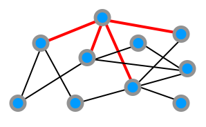
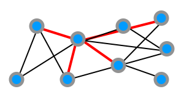

# About
FETA stands for "Framework for Evolving Topology Analysis", and is a multi-purpose java-based software for the analysis of evolving networks and models for their topology,
based on [FETA2](https://github.com/richardclegg/FETA2)

## What can I use FETA for?

* Obtaining time series of measurements on growing directed and undirected networks
* Growing networks from a range of models and combinations of these
* Fitting models to timestamped network data.
* (Soon) investigating changes in network growth over time

## What can't I use FETA for?

* Networks with disappearing nodes or edges
* Weighted networks/multigraphs

# Building and running

## Requirements

This software runs using Java, so if you haven't already, install the latest version [here](https://www.java.com/en/download/). 

The jar file is built using Apache Ant, which can be found [here](https://ant.apache.org/).

Optionally, I have some scripts for gnuplot in the tutorial for plotting - you can find gnuplot [here](http://www.gnuplot.info/)

## Installation

First clone the repository, either manually or using the command: 

```$xslt
git clone https://github.com/narnolddd/FETA3.git
```

## Building

Then run the command:

```$xslt
ant jar
```

to make the jar file.

## Running

Once you have the jar file, FETA is executed from the command line as:

```$xslt
java -jar feta3-1.0.0.jar scripts/[some-script-name].json
```

The single argument `scripts/[some-script-name].json` is a JSON config file telling FETA what action to perform. The next section describes how this works.

# Examples

## Obtaining time series of network measurements

Let's do an example of obtaining a time series of measurements from a timestamped network dataset. In the `data` folder there's a file 'cit-HepPh-ordered.txt'
which is a timestamped citation network dataset from ArXiV high energy physics, available from [SNAP](https://snap.stanford.edu/data/). We will 
use the script `MeasureCitations.json` in the `tutorial_scripts` folder, which looks like:

```JSON
{
  "Data": {
    "GraphInputFile": "data/cit-HepPh-ordered.txt",
    "GraphInputType": "NNT",
    "Directed": false
  },
  "Action": {
    "Measure": {
      "Start": 10,
      "Interval":100,
      "MaxNodes": 10000
    }
  }
}
```

The `Data` tag tells FETA what type of input to expect:

* The `GraphInputFile` tag should be self-explanatory. 
* `GraphInputType` allows either "NNT" or"NN" - this refers to whether or not the edgelist is timestamped. "NNT" is for edges 
which look like `NODE-1 NODE-2 TIMESTAMP`, "NN" for `NODE-1 NODE-2`. In the latter case, edges will be treated as arriving sequentially. 
* `Directed` refers to whether the edges should be treated as directed or not.

The `Action` tag tells FETA what to do with the inputted file; in this case we want to take measurements of it. We can specify:

* `Start` - time at which FETA will start taking measurements.

* `Interval` - time between measurements

* Stopping condition. This can either be a latest time `MaxTime`, maximum number of nodes `MaxNodes` or links `MaxLinks`. This specifies
how long the measurements should take place for - in this example the measurements will finish when the network size has reached 10000 nodes.

In the terminal, run the command 

```$xslt
java -jar feta3-1.0.0.jar tutorial_scripts/MeasureCitations.json > tutorial_scripts/CitationsTS.dat
```

It may take a minute or so to run, as the network file is quite big.

You should now have the file `CitationsTS.dat` in the `tutorial_scripts` folder. The columns are ordered as: timestamp, number of nodes,
number of links, average degree, density (number of links/number of possible links), maximum degree, average clustering coeff,
mean squared degree, degree assortativity.

To see what these time series look like, you can use your favourite plotting device. Mine happens to be [gnuplot](http://www.gnuplot.info/)
which is reasonably quick to download and usable from the terminal. If you have gnuplot installed, I have written a script for plotting these 
measurements you've just calculated - run the command:

```$xslt
gnuplot tutorial_scripts/CitationsTS.gnu
```

and there should now be some .eps plots in your `tutorial_scripts/plots` folder which should contain some looking something like this:

 


Whilst these plots are informative, note that we have treated the citation network edgelist as undirected, whereas since citations are always 
*from* one paper to another, it may more naturally be considered a directed network. What happens if we do the same process but treat the 
network as directed? 

We're going to run the same command as before, but with the file `tutorial_scripts/MeasureCitationsDirected.json` which looks like:

```JSON
{
  "Data": {
    "GraphInputFile": "data/cit-HepPh-ordered.txt",
    "GraphInputType": "NNT",
    "Directed": true
  },
  "Action": {
    "Measure": {
      "Start": 10,
      "Interval":100,
      "MaxNodes": 10000
    }
  }
}
```

This is identical to the previous file `tutorial_scripts/MeasureCitations.json` apart from the `Directed` tag being changed from
`false` to `true`. 

Let's run the command 

```$xslt
java -jar feta3-1.0.0.jar tutorial_scripts/MeasureCitationsDirected.json > tutorial_scripts/CitationsTSDirected.dat
```

Now, notice that some of the measurements which made sense for undirected networks may not make sense or at the very least need some
adaptation for directed networks. For instance, 'average degree' will be split into two measurements of 'average in-degree' and 'average
out-degree'. Also, the clustering coefficient is now ill-defined as the concept of a triangle of nodes in directed networks doesn't make 
much sense now. With this in mind, the columns are ordered as: timestamp, number of nodes, number of links, average in-degree, average 
out-degree (both identical), maximum in-degree, maximum out-degree, mean squared in-degree, mean squared out-degree, and four measures of degree assortativity
(in-in, in-out, out-in, out-out).

Again, if you have gnuplot, run:

```$xslt
gnuplot tutorial_scripts/CitationsTSDirected.gnu
```

which will generate some .eps files in the plots folder. Compare with the plots generated when we treated the network as undirected.

 


## Working with evolving network models

Whilst taking network measurements of timestamped is certainly one helpful feature of FETA, the main focus of the software is on 
a versatile modelling and model validation framework for evolving networks. For a mathematically detailed description of the framework, see the paper
[Likelihood-based assessment of dynamic networks](https://eprints.soton.ac.uk/397485/1/feta_comnet_2015.pdf) by Richard Clegg, Ben 
Parker and Miguel Rio. For the purpose of using the code, I'll give a basic overview.

Network growth models are specified in two parts. The first is the *Operation Model*, which determines the type of graph transformation
that occurs at each iteration. For example, adding a new node and connecting to 3 existing nodes, such as in the traditional Barabasi-Albert
model. The second part is the *Object Model*. This model takes a network topology (possibly with some metadata) and assigns a probability to
each of the nodes in the network to be chosen. For example, in the Barabasi-Albert model, the probability of a node being chosen is proportional
to its degree. 

### Operation Model

For the operation model, we consider just two very simple types of growth operations which we'll call *external* and *internal stars*.

Either a new node joins the network and connects to a number of (existing or new) nodes as below, which we term an *external star*

  

Alternatively, an existing node connects to a number of other existing nodes, which we call an *internal star*:

 

The full operation model specifies a sequence of these operations for the network evolution. 

The current choices of Operation Model for the user are `Email` and `PreferentialAttachment` - Email is named as such to mimic email 
networks, with growth comprising a mixture of internal and external stars, and PreferentialAttachment is named after the original 
Barabasi-Albert paper, with networks growing by addition of a single node connecting to a fixed number of existing nodes.